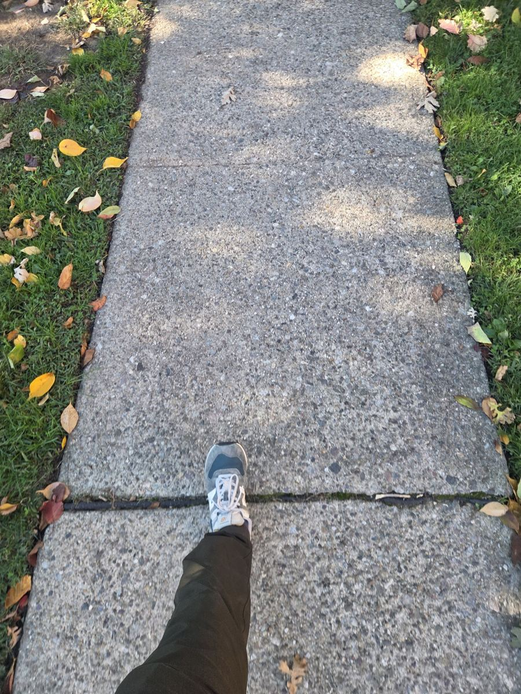

# Don't Step on a Crack

A first-person walk home along a sidewalk. Every crack, line or pothole you land on breaks one of Mom's vertebrae, and the Mom Cam in the corner shows it. The game is at `site/dont-step-on-a-crack/index.html`. Its leaderboard comes from [SPEC-001](../../specs/SPEC-001-leaderboards.md) and its folder layout from [SPEC-003](../../specs/SPEC-003-repo-layout.md). There is no build spec for the game itself, so its history is in git and in this doc.

## How it started

Jonnie and his wife were out for a walk, and he started wondering how to turn the walk into a game. He took this photo mid-step, right on a joint, and it started it all:



The rhyme did the rest ("Step on a crack, break your mother's back"): a first-person view looking down at your own feet, with Mom paying for every misstep.

## Rules

- **Score:** feet walked. Ties go to the faster time.
- **Health:** Mom has 6 vertebrae (`MAXHP`), L5 up to T12. Landing a shoe on a crack, a slab joint, a flagstone line or a pothole breaks one. A two-foot jump landing counts once. Near misses only make her flinch. When the last one goes, the game is over.
- **Touch:** tap the left or right half of the screen to step with that foot. Hold a side to lift the foot and slide it forward, slide your thumb to steer, and let go to put it down. A tap shorter than 0.16 s (`TAP`) takes a normal 1.35 ft stride. Tap both sides together to jump.
- **Overreaching:** hold too long at full reach and the leg wobbles. After 0.85 s (`WOB`) it snaps back and the clean streak resets.
- **Keyboard:**
  - A and D are the left and right feet. W or Up takes whichever foot is due next. Space jumps, and Left and Right steer.
  - S, G or Shift arms a giant step.
  - Esc or P pauses, M toggles sound, F toggles full screen.
  - Space or Enter starts the game and picks up Mom's call.
- **Giant step** ("Mother, may I?"): a 3.6 ft reach. Runs start with 2, and you can hold up to 3. Pressing it mid-swing also rescues a wobbling leg. You earn one when Dad or a coupon would heal Mom but she's already at full health.
- **Dad:** every 10 clean steps (`STREAK_EVERY`), Dad walks on Mom's back and fixes one vertebra.
- **Coupons** on the sidewalk heal one vertebra, or give a giant step if she's fine.
- **Calzone**, the Shmookies' corgi, comes running if you stand still too long. That's 3.4 s on the first street, less on later ones. Two forward steps lose him. If he reaches you he herds you sideways and your streak resets.
- **Obstacles** start 12–18 s in: a runaway skateboard, the neighbors' kickball, or Mrs. Shmookie's leash stretched across the path. Jump over them. A hit costs your streak and makes you stumble, which only hurts Mom if the stumble lands on a crack.
- **The squirrel** dashes across 2.4–5.6 ft ahead of your front foot every 26–44 s (16–34 s on Oak St), chittering as it comes, and stops once in the middle to stare. Step on it, land a jump on it, or let it run into a planted foot, and you jump back 1.6–2.2 ft: the streak goes, the feet walked go down with you, and the landing counts like any other. A lifted foot or a jump passes over it, and in heelies it hops your wheels.
- **Power-up shoes** lie on the sidewalk in pairs. Step on them to put them on:
  - Heelies: 6 s of rolling, where cracks don't count and obstacles get knocked away. Where the wheels stop, both feet land, like a two-foot jump: a crack under either breaks one vertebra. The stopping spot shows as two dashed footprints for the last 1.6 s (`ROLL_SHOW`), so you can lean onto clean concrete.
  - Moon shoes: 15 s of long, steerable jumps.
  - Ballerina shoes: 10 s on tiptoe. Only a circle at the front of each shoe counts for cracks (the pink circle on the aiming outline), but reach and stride drop to 1.6 ft and 1.0 ft (`TIP`).
  - Picking up the pair you're already wearing adds half its time (heelies +3 s) without restarting the roll. A different pair swaps; leaving heelies that way lands you where you are.
  - There is exactly one pair per street from Linden St on, and one every 10 slabs on Quarry Ln, on a random slab of that stretch (`shoePlan`). The kinds are dealt from a shuffled set of three, so Linden St, Oak St and Old Mill Rd always get one of each. Luck decides where, not how many.

## Streets

The walk is a run of 5 ft slabs (`S`), and the street changes at slab 6, 14, 24 and 34 (`STAGE_START`). Each street has less time for a full swing (`STAGES[].T`). The sidewalk is generated per slab, and a safe path is guaranteed (below).

| Street | Swing time | What's on the slabs |
| --- | --- | --- |
| Maple Ave (fresh pour) | 0.72 s | joints only |
| Linden St (hairline cracks) | 0.63 s | hairline cracks |
| Oak St (root heave) | 0.54 s | big branching cracks, hairlines, heaved slabs |
| Old Mill Rd (old flagstone) | 0.47 s | flagstones, hairlines |
| Quarry Ln (condemned) | 0.42 s, falling to 0.33 s | spiderweb cracks, potholes, big cracks, more as you go |

Time between obstacles also shrinks by street (`OBS_GAP`).

**Fairness guarantee:** `genSlab` checks every slab with `reach` to make sure there's a crack-free route from the last safe ground. The check uses more cautious step limits than the player has (0.6–2.0 ft forward, 1.4 ft sideways). If a slab fails, it retries with fewer cracks. The seventh try is joints only.

## Board 2 playtest round

Playtesters said the squirrels should do something, heelies were too strong (especially picking up a second pair, which restarted the full 6 s), the shoeboxes looked alike, and asked for ballerina shoes. Before board 2, shoeboxes were rolled per slab (about one a street on average, but a run could get none or three), and a second pair of heelies restarted the timer and the roll.

Checked so far only by scripted runs in a headless browser: placement, tiptoe footprints, stacking, the heelies stop, and every way into a squirrel. Still needs a human: whether squirrel run-ins feel fair at that spawn distance, and whether heelies still feel worth grabbing.

## Leaderboard

| | |
| --- | --- |
| Game ID | `dont-step-on-a-crack`, board 2 (`scores/games.json`), following [the leaderboard guide](../guides/00-leaderboards.md) |
| Score | feet walked, up to 1,000,000 |
| Meta | `time_ms`, `steps` and `streak` (the best clean streak in the run) |
| Ranking | ties go to the lower `time_ms` |
| Local bests | `dsotc-best-<BOARD>` and `dsotc-best-streak-<BOARD>` |

| Board | Change |
| --- | --- |
| 1 | Original game |
| 2 | Squirrels knock you back, heelies land where they stop and stack by adding time, ballerina shoes, one pair of shoes per street (same scoring rules as 1) |

At game over Mom calls. After the call is picked up, the results count up and the board shows inside the phone, with initials entry if you placed. The title screen has a **High scores** button that opens the board over the title. The board shows feet, time and streak.

## Code entry points

`site/dont-step-on-a-crack/game.js` holds the game. `audio.js` is `CrackSound` (also `sfx` in the game), everything synthesized with Web Audio, and loads before `game.js`. The game logic is plain 2D in feet; the canvas is drawn flat and tilted back with a CSS 3D transform.

| Area | Entry points |
| --- | --- |
| Flow | `goTitle`, `startGame`, `pauseGame`, `resumeGame`, `reset`, `gameOver`, `showOver`, `update`, `render` |
| Input | `press`, `release`, `keyJump`, `nextSide`, `clearInput` |
| Steps | `beginSwing`, `tapStep`, `plant`, `snapBack`, `land`, `beginJump`, `landJump`, `toggleGiant`, `upgradeSwing` |
| Sidewalk | `buildSlab`, `genSlab`, `reach`, `ensureSlabs`, `footHits` (its `tip` argument is the tiptoe footprint); tuning in `STAGES`, `STAGE_START` |
| Mom and Dad | `breakVertebra`, `drawCam`, `startDad`, `dadUpdate`, `bankGiant`, `takeCoupon`; Mom's poses in `POSES` |
| Hazards | `dogUpdate`, `herd`, `stumble`, `obsUpdate`, `hitBy`, `leashUpdate`; timing in `OBS_GAP` |
| Squirrel | spawn and run-ins in `ambientUpdate`; `squirrelAt`, `startle`, `drawSquirrel`; size in `SQ_SIZE` |
| Power-ups | `shoePlan` (placement), `startPower`, `endPower`, `stopRolling`, `powUpdate`, `rollUpdate`, `rollStopAt`, `tiptoe`; durations in `POW`, tiptoe reach in `TIP` |
| Shoe art | `sneakerArt` (palettes in `SNEAKER`), `wheelArt`, `moonArt`, `slipperArt`; `drawShoe` for your feet, `drawPickup` for pairs on the sidewalk, `drawRollStop` for the heelies stop |
| Mom's texts | `momText`, `post`, `nextChat`; messages in `T`, `MOMTXT`, `ENDINGS` |
| Leaderboard | `loadLeaderboard`, `showLeaderboard`, `drawLeaderboard`, `openScores` |

The title screen runs a demo walk: `botUpdate` drives the feet through the same input path as a player. Nothing counts outside play, and the title is quiet.

## Validation

```sh
node --check site/dont-step-on-a-crack/game.js
node --check site/dont-step-on-a-crack/audio.js
python3 tools/check_boards.py
```

The browser runner `scores/test/games.py` covers Crack's end screen and title-screen High scores in portrait, landscape and desktop. It needs the local Worker and site servers from [Local development](../guides/00-leaderboards.md#local-development). There is no `tests/dont-step-on-a-crack/` harness yet. [SPEC-005](../../specs/SPEC-005-balance-bots.md) lists a Crack balance bot as follow-up work.

The preview card and thumbnail (`site/dont-step-on-a-crack/og.png`, `thumb.webp`) are page screenshots taken by `python3 tools/og/make.py`. Run `python3 tools/stamp.py` last after any change in `site/`.
